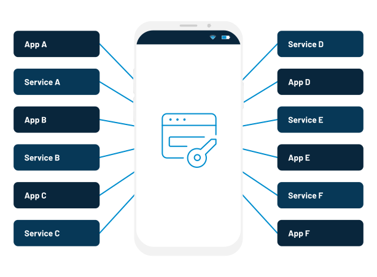
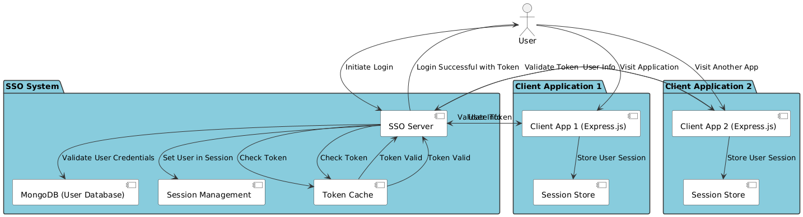
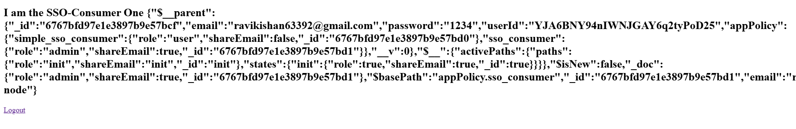
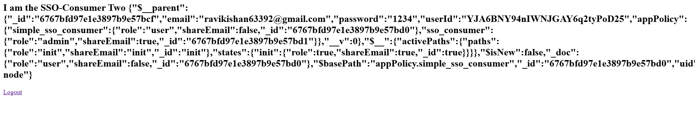

# Single Sign-On (SSO) Central Authorization System

<p float="left">


</p>




This project demonstrates a simple implementation of a Single Sign-On (SSO) authentication system using Node.js and Express. With this solution, users can log in to a central authentication server and be automatically logged into multiple consumer applications without needing to log in repeatedly.

## Features

- **Centralized Authentication**: A single authentication server (SSO Server) handles login for multiple consumer applications.
- **Local and Global Sessions**: SSO Server manages global sessions for users, and each consumer application establishes local sessions based on the global session.
- **Token-Based Authentication**: Authorization is achieved using tokens (JWT or other tokens), ensuring security and stateless communication between the SSO Server and consumer apps.
- **MongoDB Integration**: User information (like email and password) is stored securely in a MongoDB database for authentication and user management.
- **Dynamic URL Handling**: Consumer applications can dynamically register their domains with the SSO Server to enable secure access to protected resources.
- **User Registration and Authentication**: Users can register and log in through the SSO server, with a mechanism to verify user credentials and establish sessions.
- **Cross-Domain Session Management**: Session data is maintained across multiple domains, enabling a seamless experience for the user across different systems.

## Project Structure

The project consists of three main components:

1. **SSO Server**: Central authentication server handling user authentication, session management, and token generation.
2. **SSO Consumer**: Applications that integrate with the SSO Server to authenticate users and handle their sessions.
3. **MongoDB**: A database for storing user information (like email, password, etc.) to authenticate users.



Each component is structured to allow flexibility, scalability, and security.

### 1. **SSO Server** - Centralized Authentication

This component handles user login, session creation, and token issuance. The server validates the user's credentials, generates a token (JWT), and redirects the user back to the consumer app with the token. It also verifies the token's validity on subsequent requests.

**Main Features:**

- Handles user login and validation.
- Generates and returns JWT tokens after successful login.
- Manages global sessions for users across multiple applications.
- Validates incoming requests from consumer apps using tokens.

### 2. **SSO Consumer** - Consumer Applications

Consumer applications integrate with the SSO Server to authenticate users. These applications do not directly manage user authentication but rely on the SSO Server for login and session management.

**Main Features:**

- Redirects users to the SSO Server for authentication.
- Receives a token from the SSO Server and verifies its validity.
- Creates a local session for the user to access protected resources.
- Stores the JWT for subsequent requests.

### 3. **MongoDB** - User Management

User data (email, password, etc.) is securely stored in a MongoDB database. The system allows the creation of new users and authentication through their credentials.

**Main Features:**

- Stores user credentials (hashed passwords).
- Provides user data during authentication.
- Securely manages passwords using hashing techniques (e.g., bcrypt).

## Prerequisites

- Node.js and npm installed.
- MongoDB instance running locally or via cloud services like MongoDB Atlas.
- Basic understanding of JWT, Express.js, and MongoDB.
  
You can install dependencies using `npm install`.

## Setup and Installation

### 1. **Clone the Repository**

Clone the project to your local machine:

```bash
git clone https://github.com/Ravikisha/Node-SSO-Gateway.git
cd Node-SSO-Gateway
```

### 2. **Install Dependencies**

Navigate to the root directory of each project (SSO Server, SSO Consumer) and install the necessary dependencies.

For **SSO Server**:

```bash
cd server
npm install
```

For **SSO Consumer**:

```bash
cd client1
npm install

# In another terminal
cd client2
npm install
```

### 3. **MongoDB Setup**

Make sure MongoDB is installed and running on your machine, or use a cloud instance like MongoDB Atlas.

Create a `.env` file in the root of both the SSO Server and SSO Consumer directories with the following contents:

```bash
MONGODB_URI=mongodb://localhost:27017/sso-db
```

This connects the application to your MongoDB instance.

### 4. **Run the Application**

To run the SSO Server:

```bash
cd server
npm run dev
```

To run the SSO Consumer:

```bash
cd client1
npm run dev

# In another terminal
cd client2
npm run dev
```

Ensure that the **SSO Server** is running before the **SSO Consumer**, as the consumer depends on the SSO Server for authentication.

### 5. **Test the Application**

- Open your browser and visit `http://localhost:3000` for the SSO Server login page.
- Upon successful login, the user will be redirected to the consumer app, where their session will be established automatically.
- Test by navigating to `http://localhost:3001` & `http://localhost:3002` for the SSO Consumer.

### 6. **Accessing Multiple Consumer Apps**

The solution supports multiple consumer applications. To test this:

1. Add additional consumer applications by following the same structure as `sso-consumer`.
2. Make sure to configure the `allowedOrigins` in the SSO Server to accept requests from these new applications.

For example, update the `alloweOrigin` configuration in the SSO Server:

```javascript
const allowedOrigin = {
  "http://localhost:3001": true,
  "http://localhost:3002": true,
  "http://localhost:3000": false,
};
```

## Key Code Features

- **SSO Authentication Middleware** (`isAuthenticated`): Ensures that the user is authenticated before accessing protected resources. If not authenticated, they are redirected to the SSO Server for login.

- **Login Process**: The SSO Server validates the user’s credentials and generates a JWT token, which is sent back to the consumer app for session creation.

- **Token Validation**: After receiving the token, the SSO Consumer validates it by making a request to the SSO Server to ensure the token is valid.

- **Session Management**: Both global sessions (SSO Server) and local sessions (SSO Consumer) are managed to maintain user authentication across systems.

- **Security Considerations**:
  - Tokens are validated and refreshed to prevent unauthorized access.
  - User credentials are stored securely in MongoDB with password hashing (bcrypt).
  - JWT tokens are used to authorize and authenticate users across multiple systems without needing to re-enter credentials.

## Adding New Consumer Applications

To add new consumer applications to the SSO system:

1. Set up a new application with the same structure as `client1`.
2. Register the new application in the SSO Server’s `allowedOrigin` configuration.
3. Ensure that the new consumer app redirects to the SSO Server for authentication.

## Logout Functionality

To log out, the user needs to clear both their **local session** (in the consumer app) and **global session** (on the SSO Server).

### **Logout Process**:

1. The user logs out from the consumer app, which removes the local session.
2. The global session on the SSO Server is destroyed, ensuring the user is logged out across all systems.

## Extra Security Considerations

- Always validate the origins of consumer applications before processing requests to the SSO Server.
- Use HTTPS in production environments to ensure secure transmission of sensitive data.
- Avoid storing sensitive user information in the JWT payload; use the token only for session validation.

## Image Reference
#### Login Page

#### Server Page

#### Client1 Page

#### Client2 Page


## Conclusion

This SSO system provides a secure and scalable method for managing user authentication across multiple consumer applications. By leveraging a centralized authentication server and token-based authentication, we can seamlessly integrate authentication across various systems while maintaining security and scalability.


# Posts

- https://dev.to/ravikishan/a-comprehensive-guide-to-building-a-single-sign-on-sso-gateway-with-nodejs-4lj4